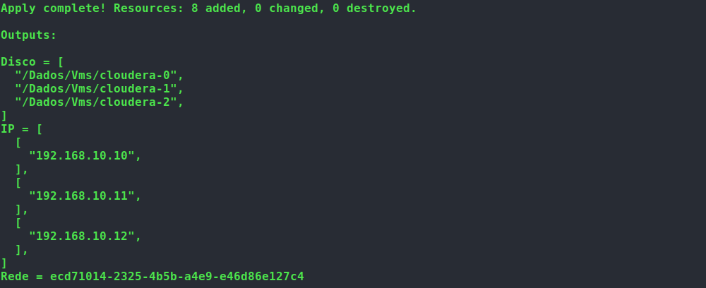
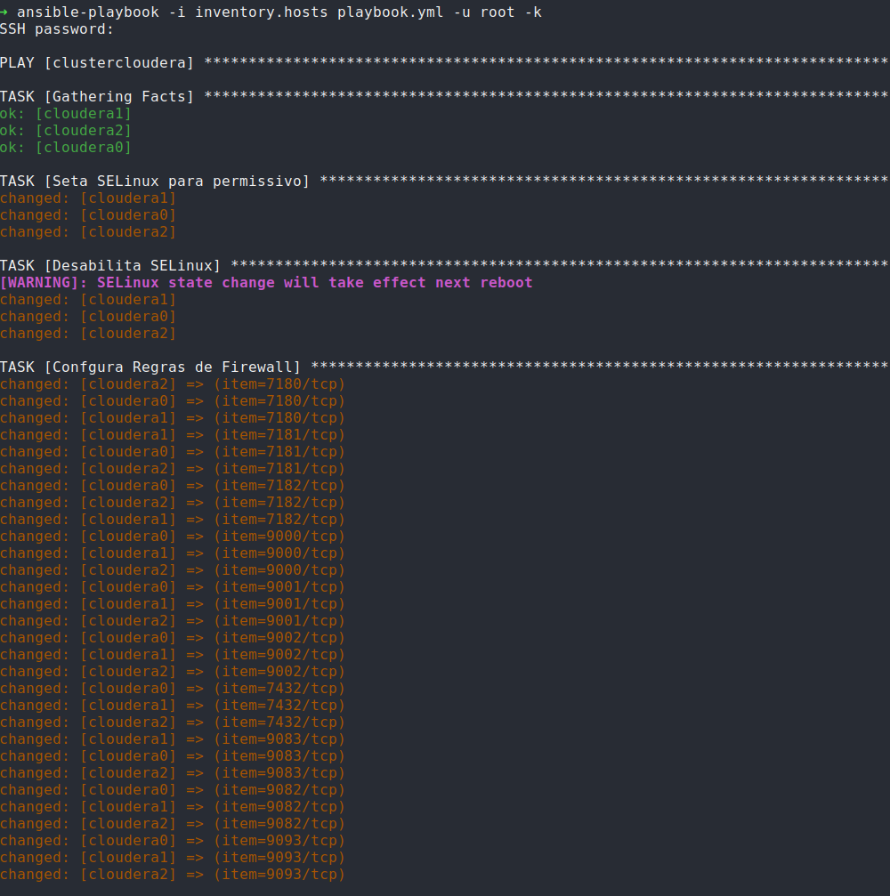
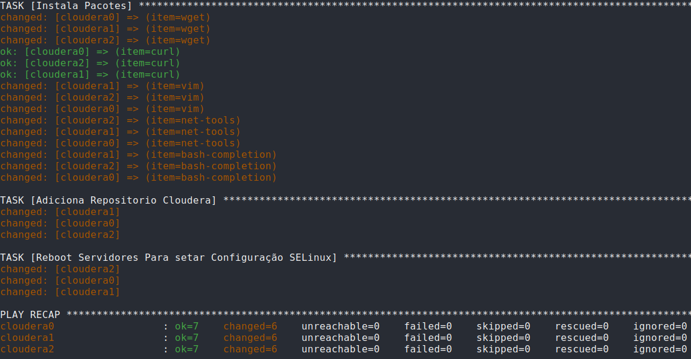
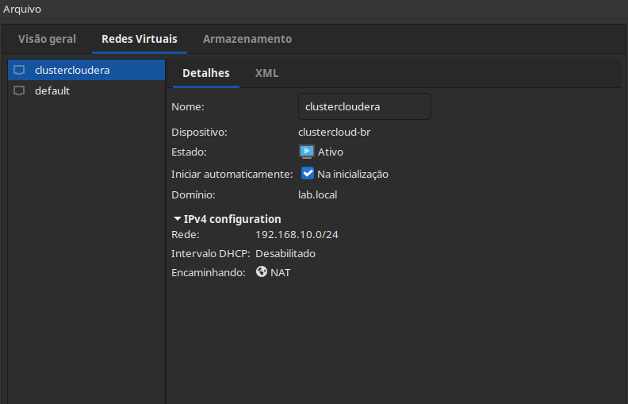

# Provisionar e Configurar Ambiente Cloudera5.16.2

Provisiomaneto de 3 hosts em ambiente KVM - libvirt via terraform e ansible-playbook para configuração dos hosts Cloudera 5.16.2.

### Tecnologias Utilizadas:
- Terrafom
- Ansible
- Linux
- KVM

### Pré requisitos:
- KVM libvirt
- golang v1.13
- Terraform v0.12
- Terraforme plugin terraform-provider-libvirt

### Terraform:
- machine.tf
- output.tf
- variables.tf

### Ansible:
- playbook.yml
- inventory.hosts

### Como Utilizar:

*variables.tf* este arquivo de variáveis permitirá realizar as personalizações necessárias para adaptação para outras necessidades. Abaixo uma pequena explicação:

Variável responsável por definir o número de Vms a ser provisionadas:
```terraform
variable "instance_count" {
  default = "3"
}
```
Variável responsável por definir a imagem(qcowc2) base do S.O formado:
```terraform
variable "disk_img" {
  default = "file:///Dados/Vms/centos7.0"
}
```
Variável responsável por definir a rede a ser provisionada:
```terraform
variable "vm_network_addresses" {
  description = "Configura Rede"
  default     = "192.168.10.0/24"
}
```
Variável responsável por definir o ip estático das Vms (OBS:existem 3 ips pois a variavel instance_count foi definida como valor 3):
```terraform
variable "vm_addresses" {
  default = {
    "0" = "192.168.10.10"
    "1" = "192.168.10.11"
    "2" = "192.168.10.12"
  }

}
```
Variável responsável por definir o nome da rede a ser provisionada no KVM:
```terraform
variable "vm_network_name" {
  description = "Define o nome da rede no KVM"
  default     = "clustercloudera"
}
```
Variável responsável por definir domínio dos hosts:
```terraform
variable "domain_name" {
  default = "lab.local"
}
```
### Provisionar Vms Terraform:

validar a estrutura dos arquivos do terraform:
</br>
`$ terraform validate`

revisar o plano de execução:
</br>
`$ terraform plan`

provisionar ambiente:
</br>
`$ terraform apply -auto-approve`

resultado após provisionar:



> OBS:foi cadastrado previamente no arquivo /etc/hosts da estação de trabalho que dispara os scripts de provisiomaneto do ambiente os ips e nomes dos hosts:
</br>

> 192.168.10.10 cloudera0
</br>
> 192.168.10.11 cloudera1
</br>
>192.168.10.12 cloudera2

### Aplicar Configurações Ansinble:

Aplicar ansible-playbook:
</br>
`$ ansible-playbook -i inventory.hosts playbook.yml -u root -k`

resultado após aplicar o ansible-playbook:




### KVM:

Resultado do provisionamento KVM

rede provisionada:



vms provisionadas:


